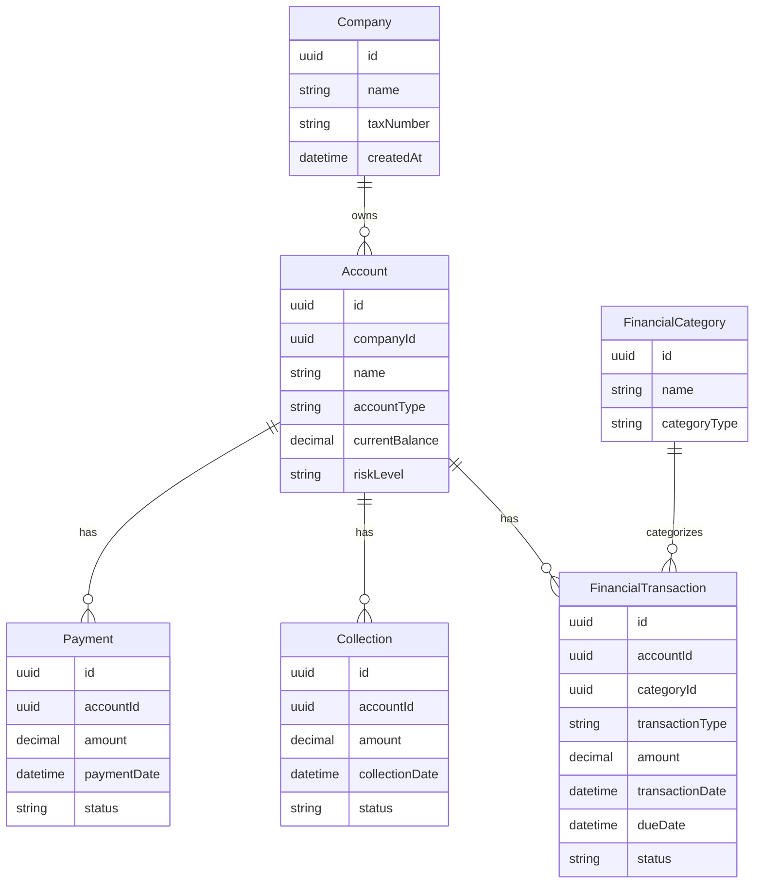

# Finlight

<p align="center">
  
</p>

<p align="center">
  
  
  
</p>

---

## İçindekiler

- [Proje Durumu](#proje-durumu)
- [Nedir?](#nedir)
- [Ne Amaçla Tasarlandı?](#ne-amaçla-tasarlandı)
- [Hedef Kullanıcı](#hedef-kullanıcı)
- [Ürün Problemi](#ürün-problemi)
- [Çözüm Yaklaşımı](#çözüm-yaklaşımı)
- [Temel Modüller](#temel-modüller)
- [Kullanım Senaryoları](#kullanım-senaryoları)
- [Finansal Dashboard Mantığı](#finansal-dashboard-mantığı)
- [Cari Risk Yaklaşımı](#cari-risk-yaklaşımı)
- [Veri Modeli Yaklaşımı](#veri-modeli-yaklaşımı)
- [Ürün Deneyimi Prensipleri](#ürün-deneyimi-prensipleri)
- [Kısa Ürün Özeti](#kısa-ürün-özeti)

---

## Proje Durumu

> **Finlight şu anda tamamlanmış bir finans ürünü değildir.**  
> Bu repo, KOBİ’ler için finansal görünürlük sağlayacak bir SaaS ürününün erken aşama ürün konsepti ve teknik temelini temsil eder.

Mevcut konumlandırma:

```text
Durum        : Early Stage Product Concept
Ürün Tipi    : SME Finance SaaS
Hedef Alan   : Gelir, gider, cari hesap, borç/alacak, tahsilat ve finansal dashboard
Amaç         : Finansal operasyonları sade, izlenebilir ve aksiyon odaklı hale getirmek
```

Bu README, Finlight’ın neyi çözmeyi hedeflediğini, hangi kullanıcıya hitap ettiğini, hangi modüllerden oluşabileceğini ve nasıl bir teknik mimariyle ürünleşebileceğini açıklamak için hazırlanmıştır.

---

## Nedir?

**Finlight**, küçük ve orta ölçekli işletmelerin finansal durumlarını daha net takip edebilmesi için tasarlanan bir finans yönetim SaaS konseptidir.

Ürün fikri; klasik gelir/gider kaydının ötesine geçerek işletmenin nakit akışı, cari müşteri/tedarikçi dengesi, tahsilat durumu, borç/alacak yapısı ve riskli müşterilerini tek bir panelde görünür hale getirmeyi hedefler.

Kısa tanım:

```text
Finlight, KOBİ’ler için gelir-gider, cari hesap ve tahsilat takibini
dashboard odaklı bir SaaS deneyimine dönüştürmeyi hedefleyen finans yönetim ürünüdür.
```

---

## Ne Amaçla Tasarlandı?

Finlight’ın temel amacı, işletme sahipleri ve operasyon ekipleri için finansal tabloyu daha okunabilir hale getirmektir.

Birçok küçük işletmede finansal bilgi şu şekilde dağınık ilerler:

- Excel tabloları
- WhatsApp notları
- Kasa defteri
- Muhasebe programı çıktıları
- Banka hareketleri
- Personelin kişisel takip dosyaları
- Geciken tahsilatlar için manuel hatırlatmalar

Finlight bu dağınıklığı azaltmayı hedefler.

Ürünün ana hedefi:

> İşletmenin finansal sağlığını sadece kayıt altına almak değil, anlaşılır göstergelerle yönetilebilir hale getirmek.

---

## Hedef Kullanıcı

Finlight özellikle şu kullanıcı tipleri için düşünülmüştür:

| Kullanıcı | İhtiyaç |
|---|---|
| KOBİ sahibi | Güncel finansal durumu hızlı görmek |
| Muhasebe destek personeli | Gelir/gider ve cari hareketleri düzenli takip etmek |
| Finans sorumlusu | Tahsilat, ödeme ve riskli cari hesapları izlemek |
| Operasyon yöneticisi | Nakit akışı ve borç/alacak dengesini yorumlamak |
| Freelance / küçük ekip | Basit ama profesyonel finans paneli kullanmak |

Finlight’ın hedeflediği kullanıcı teknik detayla boğulmak istemez. Kullanıcı, sisteme girdiğinde önce şu soruların cevabını görmek ister:

```text
Bugün finansal durumum ne?
Kimden ne kadar alacağım var?
Kime ne kadar borcum var?
Hangi tahsilatlar gecikti?
Bu ay gelir-gider dengem nasıl?
Hangi müşteriler riskli?
Yakın vadede nakit açığı oluşur mu?
```

---

## Ürün Problemi

KOBİ finans yönetiminde en sık görülen problemler:

### 1. Gelir ve giderin bütünsel görülememesi

Gelirler, giderler, ödemeler ve tahsilatlar farklı yerlerde takip edildiğinde şirketin gerçek durumu bulanıklaşır.

### 2. Cari hesapların dağınık takip edilmesi

Müşteri ve tedarikçi bazlı borç/alacak hareketleri net takip edilmezse tahsilat gecikmeleri büyür.

### 3. Tahsilat risklerinin geç fark edilmesi

Geciken alacaklar çoğu zaman ancak nakit sıkışıklığı başladığında fark edilir.

### 4. Dashboard eksikliği

Kayıt vardır ama karar destek ekranı yoktur. Kullanıcı veri görür ama yorumlamakta zorlanır.

### 5. Finansal aksiyonların önceliklendirilmemesi

Hangi ödeme kritik, hangi alacak gecikti, hangi müşteri riskli gibi kararlar manuel çıkarılır.

Finlight bu problemleri sade ama karar odaklı bir arayüzle çözmeyi hedefler.

---

## Çözüm Yaklaşımı

Finlight’ın ürün yaklaşımı üç katmandan oluşur:

```text
Kayıt → Görünürlük → Aksiyon
```

### 1. Kayıt

İşletmenin temel finansal hareketleri düzenli şekilde kaydedilir:

- Gelirler
- Giderler
- Müşteri hareketleri
- Tedarikçi hareketleri
- Borçlar
- Alacaklar
- Ödeme ve tahsilatlar

### 2. Görünürlük

Kaydedilen hareketler dashboard ekranlarında anlamlı göstergelere dönüşür:

- Toplam gelir
- Toplam gider
- Net bakiye
- Bekleyen tahsilatlar
- Geciken alacaklar
- Yaklaşan ödemeler
- Cari risk listesi
- Aylık finansal trend

### 3. Aksiyon

Sistem kullanıcıya sadece veri göstermez; hangi alanlara dikkat etmesi gerektiğini işaret eder:

- Geciken tahsilatları takip et
- Riskli müşterileri incele
- Bu ay gider oranını kontrol et
- Yaklaşan ödemeler için nakit durumunu değerlendir
- Cari hesap bakiyelerini güncelle

---

## Temel Modüller

### Dashboard

Finlight’ın ana ekranı işletmenin finansal durumunu hızlıca göstermelidir.

Örnek dashboard kartları:

- Toplam gelir
- Toplam gider
- Net nakit pozisyonu
- Bekleyen tahsilatlar
- Geciken alacaklar
- Yaklaşan ödemeler
- En riskli müşteriler
- Aylık gelir/gider trendi

---

### Gelir Yönetimi

İşletmeye giren tüm gelirlerin kategorize edilmesini sağlar.

Örnek alanlar:

- Gelir tarihi
- Gelir kategorisi
- Tutar
- Para birimi
- İlgili müşteri
- Açıklama
- Ödeme yöntemi
- Belge/fatura referansı

---

### Gider Yönetimi

İşletme giderlerinin izlenmesini sağlar.

Örnek gider kategorileri:

- Personel
- Kira
- Ofis giderleri
- Yazılım abonelikleri
- Pazarlama
- Vergi ve resmi ödemeler
- Tedarikçi ödemeleri
- Diğer operasyonel giderler

---

### Cari Hesap Yönetimi

Müşteri ve tedarikçi bazlı borç/alacak pozisyonlarını yönetir.

Cari kartında yer alabilecek bilgiler:

- Cari adı
- Cari tipi: müşteri / tedarikçi / karma
- Toplam borç
- Toplam alacak
- Net bakiye
- Son ödeme tarihi
- Son tahsilat tarihi
- Geciken tutar
- Risk durumu
- Hareket geçmişi

---

### Tahsilat Takibi

Alacakların durumunu yönetir.

Takip edilecek durumlar:

```text
Bekliyor
Kısmi ödendi
Ödendi
Gecikti
Riskli
İptal edildi
```

Tahsilat ekranı, işletmenin nakit akışı için kritik önem taşır. Bu ekran özellikle “kimden, ne zaman, ne kadar tahsil edilecek?” sorusuna net cevap vermelidir.

---

### Ödeme Takibi

Yaklaşan ve yapılmış ödemeleri takip eder.

Örnek ödeme tipleri:

- Tedarikçi ödemeleri
- Kira
- Vergi
- Maaş
- Abonelik
- Kredi / taksit
- Operasyonel gider

---

### Finansal Raporlar

Rapor ekranı işletme sahibine hızlı karar desteği sunar.

Örnek raporlar:

- Aylık gelir/gider raporu
- Cari bakiye raporu
- Geciken alacaklar raporu
- Kategori bazlı gider dağılımı
- Tahsilat performansı
- Müşteri risk listesi
- Nakit akışı özeti

---

## Kullanım Senaryoları

### Senaryo 1 — İşletme sahibi günlük durumu görmek ister

Kullanıcı dashboard’a girer ve şu göstergeleri inceler:

```text
Bugünkü nakit durumu
Bu ay toplam gelir
Bu ay toplam gider
Geciken tahsilatlar
Yaklaşan ödemeler
Riskli müşteriler
```

Bu senaryoda amaç, kullanıcının finansal durumu 1-2 dakika içinde anlayabilmesidir.

---

### Senaryo 2 — Muhasebe destek personeli cari hareket işler

Kullanıcı yeni bir müşteri veya tedarikçi hareketi ekler:

```text
Cari seçilir
İşlem tipi belirlenir
Tutar girilir
Vade tarihi eklenir
Açıklama yazılır
Kayıt oluşturulur
```

Sistem cari bakiyeyi günceller.

---

### Senaryo 3 — Geciken tahsilatlar kontrol edilir

Kullanıcı tahsilat ekranında geciken kayıtları filtreler.

Sistem şu bilgileri gösterir:

```text
Cari adı
Geciken tutar
Vade tarihi
Gecikme günü
Son ödeme/tahsilat tarihi
Risk durumu
```

Kullanıcı buradan tahsilat aksiyonu alır.

---

### Senaryo 4 — Aylık gider dağılımı incelenir

Kullanıcı rapor ekranından gider kategorilerini inceler:

```text
Personel
Kira
Tedarikçi
Vergi
Yazılım
Pazarlama
Diğer
```

Bu ekran, gereksiz maliyetlerin fark edilmesine yardımcı olur.

---

## Finansal Dashboard Mantığı

Finlight dashboard’u sadece finansal kayıt listesi olmamalıdır. Ana ekran, karar vermeyi kolaylaştıran bir kontrol paneli gibi çalışmalıdır.

Önerilen dashboard bölümleri:

### 1. Özet Kartlar

```text
Toplam Gelir
Toplam Gider
Net Durum
Bekleyen Tahsilat
Geciken Alacak
Yaklaşan Ödeme
```

### 2. Trend Grafikleri

```text
Aylık Gelir/Gider Trendi
Nakit Akışı
Tahsilat Performansı
Gider Kategorileri
```

### 3. Risk Alanı

```text
En riskli cariler
En yüksek gecikmiş alacaklar
Yaklaşan kritik ödemeler
Tahsilat performansı düşen müşteriler
```

### 4. Aksiyon Listesi

```text
Bugün takip edilecek tahsilatlar
Bu hafta ödenecek kalemler
Güncellenmesi gereken cari kayıtlar
Kontrol edilmesi gereken gider artışları
```

---

## Cari Risk Yaklaşımı

Finlight’ın güçlü farklarından biri, cari hesapları sadece bakiye olarak değil, risk sinyali olarak da yorumlaması olabilir.

Basit bir risk modeli şu metriklerden beslenebilir:

| Metrik | Açıklama |
|---|---|
| Geciken gün sayısı | Vade tarihinden itibaren geçen süre |
| Geciken tutar | Ödenmeyen toplam bakiye |
| Tahsilat geçmişi | Daha önceki ödeme düzeni |
| Açık işlem sayısı | Kapanmamış borç/alacak hareketleri |
| Son temas tarihi | Tahsilat takibi için son aksiyon zamanı |

Örnek sınıflandırma:

```text
Düşük Risk
Orta Risk
Yüksek Risk
Kritik Risk
```

Bu yapı, kullanıcıya sadece “alacak var” bilgisini değil, “önce kime odaklanmalısın?” bilgisini verir.

---

## Veri Modeli Yaklaşımı

Finlight için temel veri modeli şu kavramlar etrafında şekillenebilir:



Bu model ürünleşme sırasında genişletilebilir. Temel amaç; gelir/gider, cari hareket, tahsilat ve ödeme takibini birbirinden kopuk değil, aynı finansal bağlam içinde yönetmektir.

---

## Kısa Ürün Özeti

```text
Finlight; KOBİ’lerin gelir, gider, cari hesap, borç/alacak,
tahsilat ve ödeme süreçlerini tek bir sade finans panelinde takip etmesini
hedefleyen erken aşama bir SME Finance SaaS konseptidir.
```

---

<p align="center">
  
</p>
